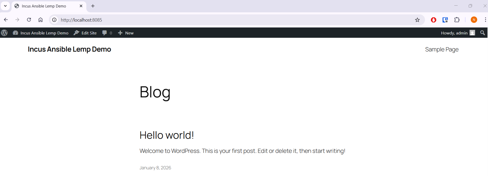
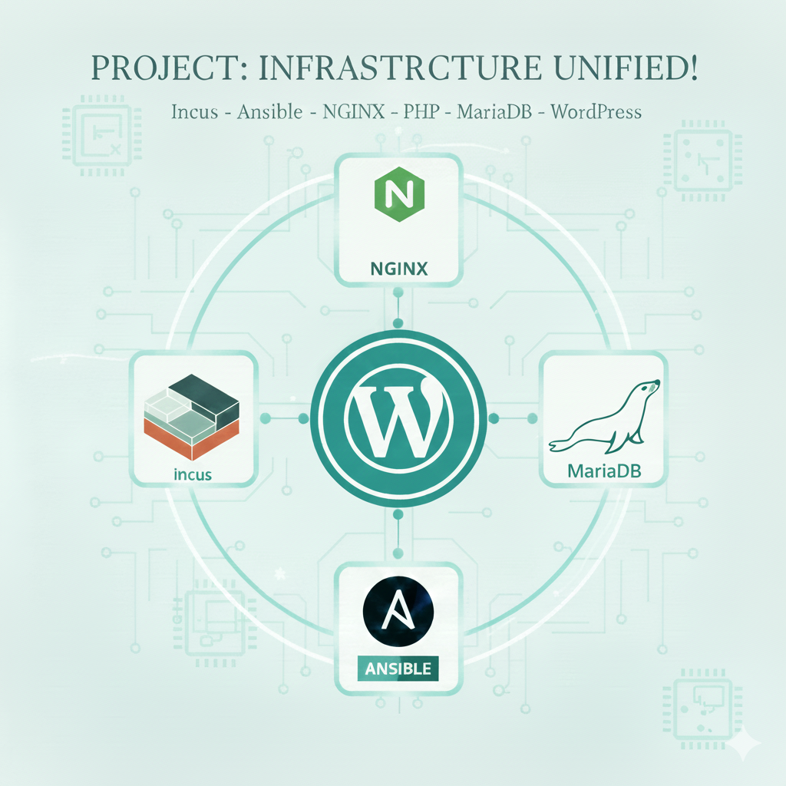

# Automated LEMP Stack & WordPress on Incus (Debian 12)

This project demonstrates an **Infrastructure as Code (IaC)** approach to provisioning a complete web server environment. 
It uses **Ansible** to automate the configuration of a LEMP stack (Linux, Nginx, MariaDB, PHP) and the deployment of WordPress inside an 
**Incus** Linux container running on WSL2.

## Architecture & Tech Stack

* **Host Environment:** WSL2 (Windows Subsystem for Linux) running Debian
* **Virtualization:** Incus (System Containers)
* **Automation:** Ansible (Modular Role-based structure)
* **Web Server:** Nginx (configured with Jinja2 templates)
* **Database:** MariaDB (secured with Ansible Vault)
* **Scripting:** PHP 8.2-FPM
* **Application:** WordPress (latest release)

## Key Features

* **Idempotency:** The playbook can be run multiple times without breaking the system or creating duplicate configurations.
* **Security First:** * Database credentials are encrypted using **Ansible Vault**.
    * Sensitive files (like `info.php`) are automatically removed after verification.
    * Secret files are excluded from version control via `.gitignore`.
* **Modularity:** The project is split into reusable roles:
    * `common`: Basic system utilities (micro, curl, git)
    * `web`: Nginx and PHP-FPM configuration
    * `db`: MariaDB installation and user/database creation
    * `wordpress`: Downloading, extracting, and configuring the CMS

## Project Structure

```text
.
├── ansible.cfg         # Ansible configuration (Vault path, inventory settings)
├── inventory.ini       # Server IP definition
├── site.yml            # Main playbook entry point
├── group_vars/         # Encrypted variables (DB passwords)
└── roles/
    ├── common/         # System tools
    ├── web/            # Nginx & PHP setup
    ├── db/             # Database setup
    └── wordpress/      # WordPress deployment
```

## How to Replicate

### 1. Prerequisites

* Linux machine or Windows machine with WSL2 enabled.
* **Incus** installed and initialized (`incus admin init`).
* **Ansible** installed (`sudo apt install ansible`).

### 2. Clone the Repository

```bash
git clone https://github.com/nlholm/incus-ansible-lemp-demo.git
cd incus-ansible-lemp-demo
```

### 3. Launch the Target Container

Create a Debian 12 container and map the port to localhost:

```bash
incus launch images:debian/12 lemp-server
incus config device add lemp-server myport80 proxy listen=tcp:0.0.0.0:8085 connect=tcp:127.0.0.1:80
```

### 4. Configure Inventory

Check the IP address of your new container:

```bash
incus list
```

Update `inventory.ini` with the container's actual IP address:

```Ini, TOML
[webservers]
10.XXX.XXX.XXX ansible_user=root
```

### 5. Handle Secrets (Ansible Vault)

The database passwords are encrypted using Ansible Vault.

To simplify the workflow, the project is configured (via `ansible.cfg`) to automatically read the decryption password from a file. 
This allows you to run playbooks without manually typing the password every time.

Create the password file in the project root directory:

```bash
echo "YOUR_VAULT_PASSWORD" > .vault_pass
```

Security Note: The .vault_pass file is listed in .gitignore, so your plain-text password will never be pushed to the repository.

### 6. Run the Playbook

Deploy the entire stack with a single command:

```bash
ansible-playbook site.yml
```

### 7. Access the site

Open your browser and navigate to: http://localhost:8085

You will see the WordPress installation screen. Once you have set up your credentials for the WordPress Dashboard, you will be greeted with a 
"Hello World!" blog text.

**Concept Clarification: Database vs. Dashboard**
* **Infrastructure Level:** Ansible automatically configured the connection between WordPress and MariaDB using the secured `wp_user` 
credential (defined in Ansible Vault). The end user genrally does not need to know or use this password.
* **Application Level:** The account you create on the "Welcome" screen is your personal **WordPress Admin** user. 
This is for managing content (posts, themes, plugins) and is separate from the database credentials.



## Learning Outcomes

* Managing Linux containers with **Incus**.
* Writing **Modular Ansible Playbooks** (Roles & Tasks).
* Implementing **Idempotency** (ensuring tasks run only when necessary).
* Using **Jinja2 Templates** for dynamic configuration (`wp-config.php`, Nginx conf).
* Securing secrets in git repositories using **Ansible Vault**.

## Use Cases & Benefits

Why choose this Incus + Ansible stack over a traditional LAMP setup?

### 1. Mass Provisioning (The "Factory" Approach)

This setup allows you to spin up **multiple** WordPress instances in minutes. By simply launching new Incus containers and adding their IP addresses 
to `inventory.ini`, Ansible will configure all of them simultaneously.
* **Scenario:** An agency managing 10 client sites can ensure every server is configured identically without manual repetition.

### 2. Isolation & Security

Unlike shared hosting, each WordPress site runs in its own isolated **system container**.
* **Containment:** If one site is compromised, the attacker cannot access other containers or the host system.
* **Resource Control:** Incus allows you to limit CPU and RAM usage per container, ensuring one busy site doesn't crash the others.

### 3. Disposable Development Environments

Need to test a major update?
1. Launch a fresh container.
2. Run the playbook.
3. Break things safely.
4. Delete the container when done.
This keeps your main development machine clean and clutter-free.

## Architecture Diagram

```mermaid
graph TD
    %% Nodes
    User([User / Browser])
    Ansible{Ansible Automation}
    
    subgraph WSL2_Host [Windows / WSL2 Host]
        direction TB
        Proxy[Incus Proxy :8085]
        
        subgraph Container [Incus Container: lemp-server]
            direction TB
            Nginx[Nginx Web Server]
            PHP[PHP-FPM]
            DB[(MariaDB)]
            WP[WordPress Files]
        end
    end

    %% Edges / Connections
    User -- "http://localhost:8085" --> Proxy
    Proxy -- "Forward to :80" --> Nginx
    
    Ansible -- "Provisions & Configures" --> Container
    
    %% Internal Container Flow
    Nginx <--> PHP
    PHP <--> DB
    PHP -- Reads/Writes --> WP
    ```

  
